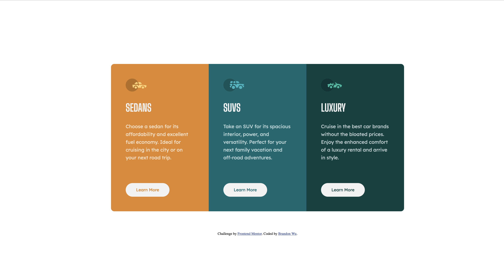

# Frontend Mentor - 3-column preview card component solution

This is a solution to the [3-column preview card component challenge on Frontend Mentor](https://www.frontendmentor.io/challenges/3column-preview-card-component-pH92eAR2-). Frontend Mentor challenges help you improve your coding skills by building realistic projects.

### Screenshot

## My process

### Built with

- CSS Grid

### What I learned

- Experimenting with css grid auto-flow property to help create responsive layouts
- Tried doing this without css custom properties, and realized that it is much harder to manage, especially with colors

## Author

- Website - [Brandon Wu](https://github.com/BrandonWu500)
- Frontend Mentor - [@BrandonWu500](https://www.frontendmentor.io/profile/BrandonWu500)
